<!-- Before publishing: replace YOUR_EMAIL_ADDRESS in the "Connect with me" section. -->

<h2 align="center">About me</h2>

<table>
<tr>
<td width="62%" valign="top">

I'm a **MERN Stack Development student** at **Luminar Technolab, Kochi**. I started with computer hardware and networking through my **Diploma in Computer Hardware Engineering**, and I'm now learning modern web development.

I'm interested in software and IT, and I build projects to turn what I learn into practical skills.

</td>
<td width="38%" valign="top">

**Quick facts**

- **Studying:** MERN Stack Development
- **Education:** Diploma in Computer Hardware Engineering
- **Interests:** Full stack web development, software and IT, computer hardware, networking, web technologies

</td>
</tr>
</table>

<h2 align="center">Currently learning</h2>

HTML → CSS → JavaScript → Bootstrap → Tailwind CSS → React → Node.js → Express.js → MongoDB

<h2 align="center">Tech stack</h2>

<table>
<tr>
<td width="33%" valign="top" align="center">
<b>Frontend</b>  
 
HTML5, CSS3, JavaScript, Bootstrap, Tailwind CSS, React.js
</td>
<td width="33%" valign="top" align="center">
<b>Backend</b>  
 
Node.js, Express.js
</td>
<td width="33%" valign="top" align="center">
<b>Database</b>  
 
MongoDB, MySQL
</td>
</tr>
<tr>
<td width="33%" valign="top" align="center">
<b>Programming</b>  
 
JavaScript, Python
</td>
<td width="33%" valign="top" align="center">
<b>Tools</b>  
 
Git, GitHub, VS Code
</td>
<td width="33%" valign="top" align="center">
<b>Hardware and networking</b>  
 

</td>
</tr>
</table>

<h2 align="center">Learning journey</h2>

<h2 align="center">Projects</h2>

<table>
<tr>
<td width="50%" valign="top">

### AI Career Navigator

Full-stack career platform MVP with secure sign-in, a profile with a transparent career score, and an AI-generated professional summary.

 

</td>
<td width="50%" valign="top">

### Blood Bank Management System

Web app for managing blood donors, patients, donation requests and blood stock, with an admin approval workflow.

Based on the open-source [Blood Bank Management System](https://github.com/sumitkumar1503/bloodbankmanagement) by Sumit Kumar (MIT license).

</td>
</tr>
<tr>
<td width="50%" valign="top">

### YouTube Clone

A YouTube-style home page and login page, built to practise HTML and CSS layout.

 

</td>
<td width="50%" valign="top">

### Portfolio Website

My personal portfolio with skills, education, projects and a contact form. I update it as I learn.

 

</td>
</tr>
</table>

<h2 align="center">Skills</h2>

Self-assessed: <b>Learning</b> = studying now, <b>Practicing</b> = using it in projects, <b>Familiar</b> = foundation from my diploma

<table>
<tr><th align="left">Area</th><th align="left">Level</th><th align="left">What I'm working on</th></tr>
<tr><td><b>Web development</b></td><td></td><td>Building full-stack web apps with the MERN stack</td></tr>
<tr><td><b>Frontend development</b></td><td></td><td>HTML, CSS, JavaScript, Bootstrap, Tailwind CSS, React.js</td></tr>
<tr><td><b>Backend development</b></td><td></td><td>Node.js and Express.js</td></tr>
<tr><td><b>Database</b></td><td></td><td>MongoDB, plus MySQL from my database project</td></tr>
<tr><td><b>Git and GitHub</b></td><td></td><td>Version control and publishing my projects</td></tr>
<tr><td><b>Computer hardware</b></td><td></td><td>Foundation from my Diploma in Computer Hardware Engineering</td></tr>
<tr><td><b>Networking</b></td><td></td><td>Networking basics</td></tr>
<tr><td><b>Problem solving</b></td><td></td><td>Breaking problems into parts, testing each one, keeping solutions simple</td></tr>
</table>

<h2 align="center">GitHub statistics</h2>

<h2 align="center">Contributions</h2>

<b>Learning, building, and committing consistently.</b>

<h2 align="center">Connect with me</h2>

